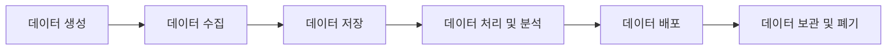

## 데이터 수명 주기(Data Lifecycle)
데이터 수명 주기는 데이터가 생성되고 사용되며, 폐기되는 전 과정을 나타냅니다. 

### 주요 단계:
1. **데이터 생성(Data Creation):**
    - 데이터가 시스템에서 생성되는 초기 단계
    - 예: IoT 기기, 사용자 입력, 트랜잭션 로그

2. **데이터 수집(Data Collection):**
    - 다양한 소스에서 데이터를 수집하여 중앙화
    - 예: API, ETL/ELT 프로세스, 스트리밍 데이터

3. **데이터 저장(Data Storage):**
    - 데이터를 저장하고 관리하기 위한 단계
    - 예: 데이터베이스, 데이터 웨어하우스, 데이터 레이크

4. **데이터 처리 및 분석(Data Processing and Analysis):**
    - 데이터를 정리하고 분석하여 인사이트를 도출
    - 예: 데이터 클렌징, 변환, 머신러닝 모델 적용

5. **데이터 배포(Data Distribution):**
    - 필요한 사용자나 시스템에 데이터를 제공
    - 예: 대시보드, 애플리케이션 통합, Reverse ETL

6. **데이터 보관 및 폐기(Data Archiving and Deletion):**
    - 사용하지 않는 데이터를 보관하거나 폐기
    - 예: 규제 준수, 저장 공간 최적화



---

## Reverse ETL과 데이터 수명 주기의 연관성
- Reverse ETL은 **데이터 배포** 단계에서 중요한 역할을 수행합니다.
- 데이터 수명 주기 전반에 걸쳐 수집되고 저장된 데이터를 비즈니스 팀이 쉽게 활용할 수 있도록 지원합니다.

```python
# Reverse ETL 간단한 Python 예제 (가상)
import requests

# 데이터 웨어하우스에서 추출된 데이터 예시
data = [
    {"customer_id": 1, "email": "example1@test.com", "status": "active"},
    {"customer_id": 2, "email": "example2@test.com", "status": "inactive"},
]

# CRM API로 데이터 전송
for record in data:
    response = requests.post(
        "https://crm.example.com/api/v1/sync",
        json=record
    )
    if response.status_code == 200:
        print(f"Successfully synced: {record['customer_id']}")
    else:
        print(f"Failed to sync: {record['customer_id']}")
```

---
